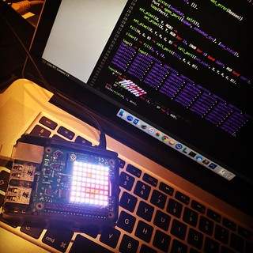

# Erlang Sense Hat

[](https://github.com/mteinum/erlang-sensehat/actions/workflows/build.yml)
[](https://www.erlang.org/)
[](LICENSE)

Raspberry Pi Sense Hat Erlang port driver



The Sense Hat is a framebuffer device and there is no native support in Erlang to open this through the file api.

If you try to open the device from erlang, this is the result:

```
Erlang/OTP 18 [erts-7.0] [source] [smp:4:4] [async-threads:10] [kernel-poll:false]

Eshell V7.0  (abort with ^G)
1> file:open('/dev/fb1', []).
{error,eisdir}
```

This project implements a port driver in C, that will allow Erlang to control the 8x8 LED display on the Sense Hat.

http://erlang.org/doc/reference_manual/ports.html

Specification for the Sense Hat

https://www.raspberrypi.org/blog/astro-pi-tech-specs/

> 8×8 RGB LED matrix with ~60fps refresh rate and 15-bit colour resolution (RGB 5 5 5): Cree CLU6AFKW/CLX6AFKB (data sheet)
Accessible via frame buffer driver /dev/fb1 where each pixel is 16 bit (RGB 5 6 5).

**WARNING**

This code is experimental and not production ready (i.e., not ready for *Astro Pi* on the International Space Station [ISS](https://astro-pi.org/)).  

## Prerequisites

* Raspberry Pi (any model with 40-pin GPIO header)
* Raspberry Pi Sense HAT attached
* Build tools: `gcc`, `make`
* Erlang/OTP 18 or later

## Installation

### Install Erlang OTP

Install Erlang/OTP 18 or later. You can use:
* Official packages: https://www.erlang.org/downloads
* Erlang Solutions: https://www.erlang-solutions.com/downloads/
* Via asdf: `asdf install erlang latest`

### Build

Using rebar3 (recommended):
```bash
rebar3 compile
```

Or using make:
```bash
make all
```

### Usage Example

Start Erlang:

```
erl
```

Start the port driver, which will find the framebuffer device and map it into memory:

```
Eshell V7.0  (abort with ^G)
1> sensehat:start().      
<0.35.0>
2> shexample:logo().
ok
3> sensehat:set_rotation(180).
ok
4> sensehat:stop().
sensehat_drv: stop
stop

```

## API Documentation

### sensehat module

* `start()` - Start the Sense Hat port driver
* `stop()` - Stop the port driver and close the connection
* `set_pixel(X, Y, RGB)` - Set a single pixel at coordinates (X, Y) with RGB color
* `set_pixels(Pixels)` - Set multiple pixels at once
* `clear()` - Clear the display (set all pixels to black)
* `clear(RGB)` - Clear the display with specified RGB color
* `get_gamma()` - Get current gamma correction values
* `set_gamma(Gamma)` - Set gamma correction
* `set_gamma_low_light()` - Apply low light gamma correction
* `reset_gamma(Gamma)` - Reset gamma correction to specified values
* `set_rotation(Degrees)` - Rotate the display (0, 90, 180, or 270 degrees)

### Joystick Support

The `sensestick_drv.c` driver provides joystick integration for the Sense Hat's 5-button joystick (up, down, left, right, and enter/click). See `st_event.erl`, `st_event_manager.erl`, `st_port.erl`, and `st_supervisor.erl` for the event handling implementation.

## TODO

* Expand text rendering capabilities (basic framebuffer support exists in `shfb.erl`)
* Add more example applications
* Improve error handling and validation
* Add unit tests

## Reference

* [Port driver example (erl and c)](http://erlang.org/doc/tutorial/c_portdriver.html)
* [open_port/2 (erl)](http://erlang.org/doc/man/erlang.html#open_port-2)
* [Port driver (erl)](http://erlang.org/doc/reference_manual/ports.html)
* [erl_driver C API](http://erlang.org/doc/man/erl_driver.html)
