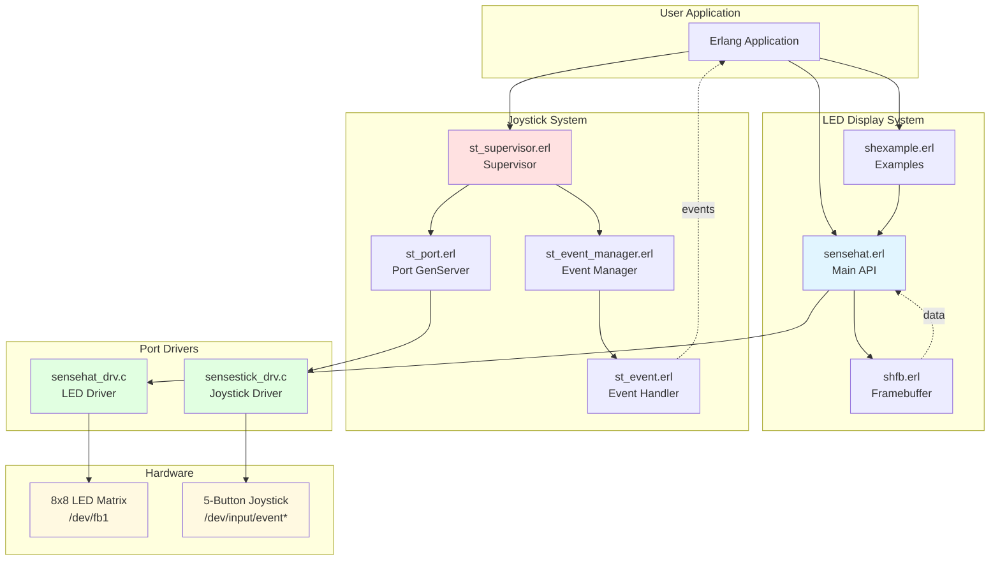
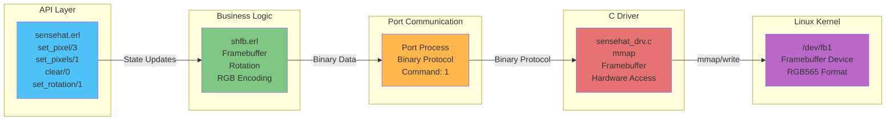
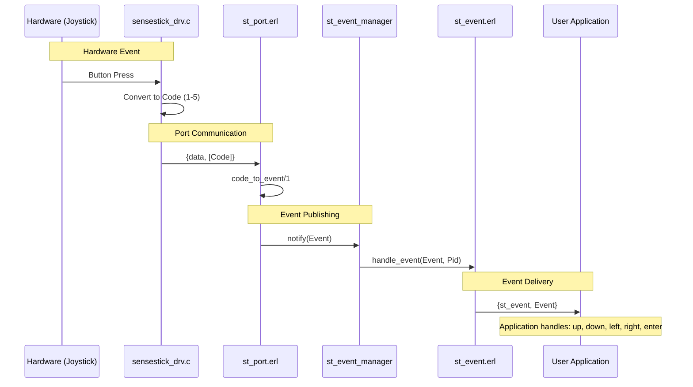
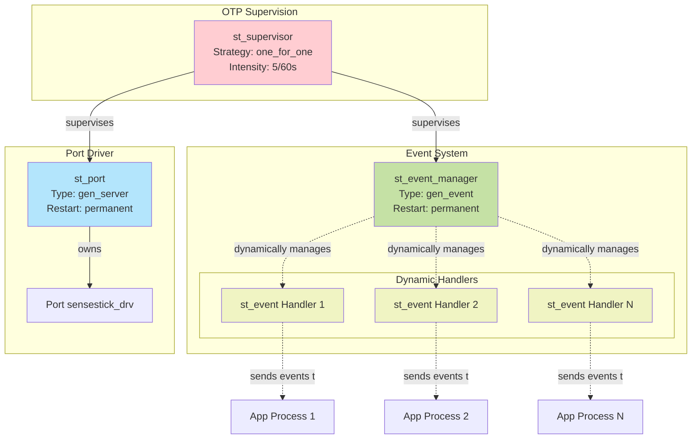
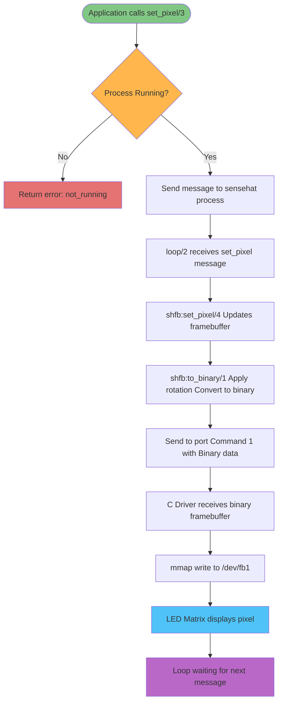
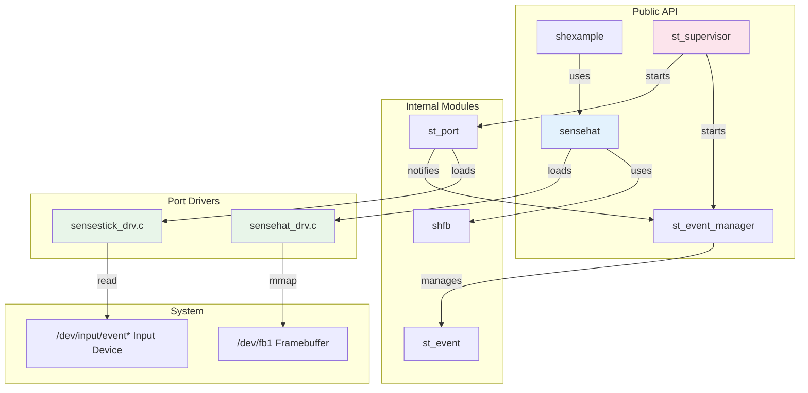

# Erlang Sense HAT Architecture

## System Overview

## LED Display Architecture

## Joystick Event Flow

## Process Supervision Tree

## Data Flow - Setting a Pixel

## Component Relationships

